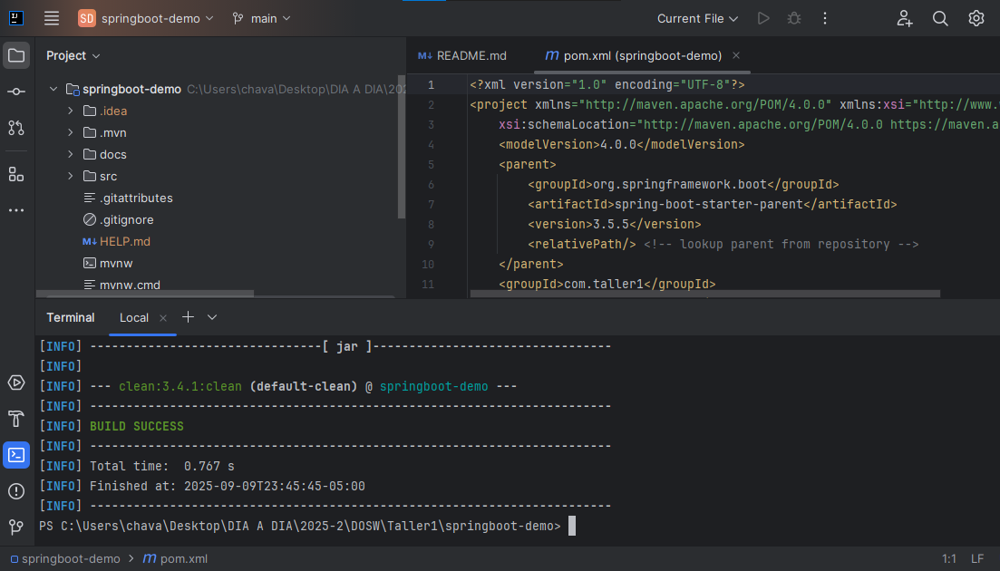

#  Taller Evaluativo 1 – Monitoreo de Stock

Este proyecto implementa un sistema de monitoreo de stock de productos usando Spring Boot y Maven.  
Fue desarrollado siguiendo los principios SOLID, aplicando el patrón de diseño Observer y utilizando inyección de dependencias**.


- preparacion de mvn:
  
---

##  Requerimientos del cliente

1. **Añadir producto** con: nombre, precio, stock y categoría.
2. **Modificar stock** de un producto existente.
3. **Notificar agentes** cada vez que el stock cambia:
    - **Agente Log** → imprime siempre el stock actualizado.
    - **Agente Advertencia** → imprime alerta si el stock < 5.

---

## Patrón de Diseño: Observer

Se aplicó el patrón **Observer**, donde:
- `ProductService` → Sujeto observado (notifica cambios de stock).
- `StockObserver` → Interfaz que define el contrato para los agentes.
- `LogAgent` y `WarningAgent` → Observadores concretos.

 Esto permite añadir más agentes en el futuro sin modificar el código existente (**Principio Open/Closed de SOLID**).

---

## 🏛 Principios SOLID aplicados

- **S** (Single Responsibility):  
  Cada clase tiene una sola responsabilidad (ej: `Product` solo guarda datos, `LogAgent` solo muestra stock, etc.).

- **O** (Open/Closed):  
  El sistema es abierto a extensión (se pueden agregar más agentes) pero cerrado a modificación.

- **L** (Liskov Substitution):  
  Todos los agentes cumplen la interfaz `StockObserver`, por lo que pueden sustituirse sin problemas.

- **I** (Interface Segregation):  
  La interfaz `StockObserver` es simple y específica para los agentes.

- **D** (Dependency Inversion):  
  `ProductService` depende de la abstracción `StockObserver` y no de implementaciones concretas.  
  Esto se logra con la **inyección de dependencias de Spring**.

---

##  Inyección de Dependencias

Spring Boot detecta automáticamente los **agentes** anotados con `@Component` y los inyecta en `ProductService` gracias al constructor:

```java
public ProductService(List<StockObserver> observers) {
    this.observers = observers;
}
```
## 4. Diagramas
- de contexto
  
    - **HU 1.1.2:** Como administrador quiero actualizar el stock de un producto y que los agentes sean notificados. (5 pts)

- **Feature 1.2:** Notificación a agentes
    - **HU 1.2.1:** Como agente Log quiero ver en consola el stock actualizado. (2 pts)
    - **HU 1.2.2:** Como agente Advertencia quiero recibir una alerta cuando el stock sea menor a 5. (3 pts)

---

### 🟦 Épica 2: Diagramas
- **Feature 2.1:** Documentación gráfica
    - **HU 2.1.1:** Como estudiante quiero un diagrama de contexto que muestre la interacción del sistema. (2 pts)
    - **HU 2.1.2:** Como estudiante quiero un diagrama de casos de uso con los escenarios principales. (2 pts)
    - **HU 2.1.3:** Como estudiante quiero un diagrama de clases con las entidades y sus relaciones. (3 pts)  


